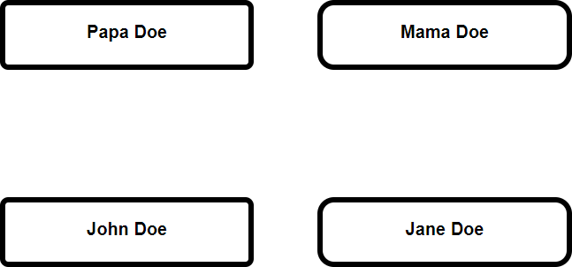
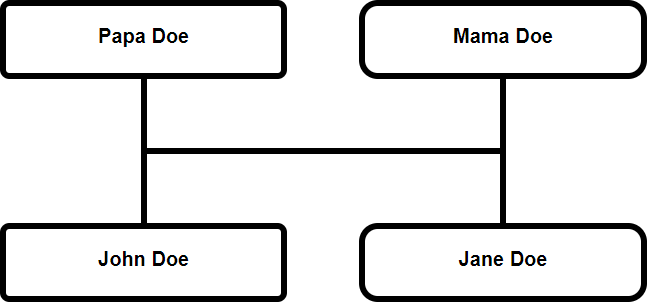
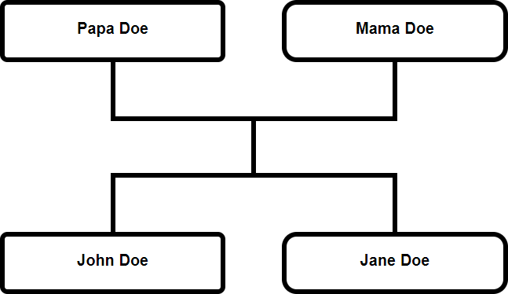
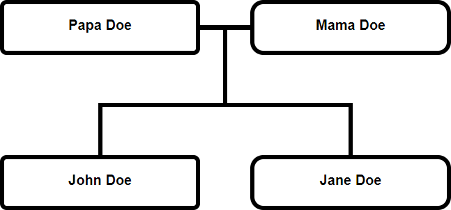
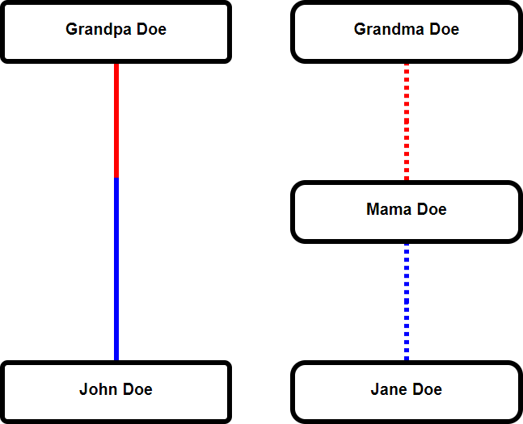
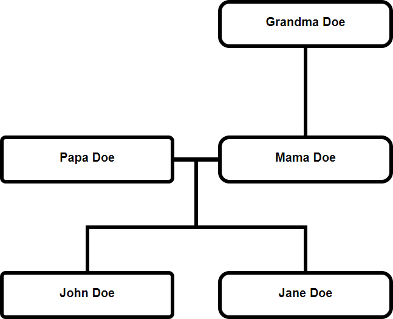
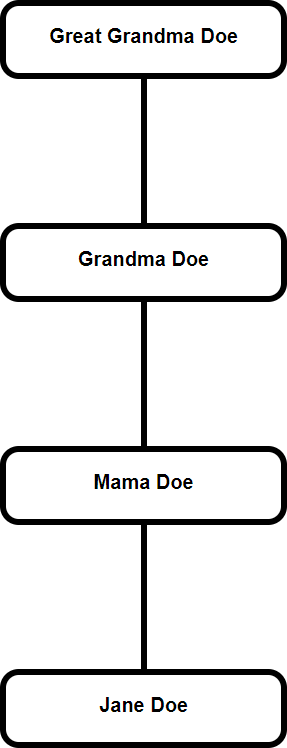
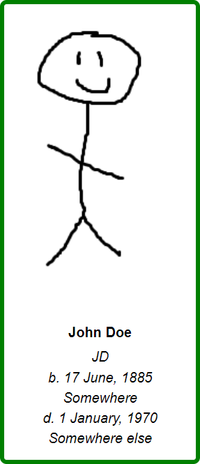

# gen-show3 interface

All interactions with gen-show3 are handled through the `FamilyTree` class.
This class allows one to specify people, information about those people,
and relationships between those people. When told to render, the `FamilyTree`
class will draw a family tree based on the information which it has been provided.

### Table of Contents

1. [Creating a FamilyTree object](#creating)
2. [Adding people to the FamilyTree](#people)
    1. [FamilyTree.addPerson](#addPerson)
    2. [FamilyTree.setActiveGeneration](#setActiveGeneration)
3. [Adding lines to the FamilyTree](#lines)
    1. [FamilyTree.addLines1](#addLines1)
    2. [FamilyTree.addLines2](#addLines2)
    3. [FamilyTree.addLines3](#addLines3)
    4. [FamilyTree.addPoint](#addPoint)
4. [Merging FamilyTree objects](#merging)
    1. [FamilyTree.merge](#merge)
    2. [FamilyTree.mergeSequential](#mergeSequential)
5. [Rendering the FamilyTree](#rendering)
    1. [FamilyTree.queueRender](#queueRender)
6. [Appendix 1: the addPerson info parameter](#app1)
7. [Appendix 2: the addLines info parameter](#app2)

## <span id="creating">Creating a FamilyTree object</span>

The `FamilyTree` constructor takes no parameters.

```javascript
var tree = new FamilyTree();
```

## <span id="people">Adding people to the FamilyTree</span>

People are added left to right. Within a given generation, a person added
earlier will appear to the left of a person added later.
The generation in which a person appears is controlled by the `activeGeneration`
attribute. The value of `activeGeneration` can be set through the
`FamilyTree.setActiveGeneration` method.

### <span id="addPerson">FamilyTree.addPerson</span>

`FamilyTree.addPerson` adds a person to the `FamilyTree` object.

```javascript
addPerson(id,info)
```

`id` is a string which uniquely identifies a person. Duplicates will
cause an exception. It cannot be an empty string
and it cannot start with a hash character (`#`).

`info` is a JavaScript object. It contains information about the person,
and the display properties of the box in which they are rendered.
See [Appendix 1](#app1) for more information.

#### Example code:

```javascript
var tree = new FamilyTree();
tree.addPerson("john-doe",{"name":"John Doe","gender":"m"});
tree.addPerson("jane-doe",{"name":"Jane Doe","gender":"f"});
tree.queueRender();
```

#### Example output:


### <span id="setActiveGeneration">FamilyTree.setActiveGeneration</span>

`FamilyTree.setActiveGeneration` sets the `activeGeneration` attribute.
This attribute tells the `FamilyTree` object where to add new people.
It is meaningless to call this method before any people have been added
to the `FamilyTree`.

```javascript
setActiveGeneration(g)
```

`g` is the generation identifier. If `g` is an `id` of one of the people already in the `FamilyTree`,
then the `activeGeneration` will be set to the generation of that person. If `g` starts with
a hash character (`#`) it is assumed to be special command as described below.

- `"#before"` -> `activeGeneration` is set to the generation before the oldest defined generation (oldest person's parents)
- `"#first"` -> `activeGeneration` is set to the oldest defined generation (generation of the oldest person)
- `"#last"` ->  `activeGeneration` is set to the youngest defined generation (generation of the youngest person)
- `"#after"` -> `activeGeneration` is set to the generation after the youngest defined generation (youngest person's children)

#### Example code:

```javascript
var tree = new FamilyTree();
tree.addPerson("john-doe",{"name":"John Doe","gender":"m"});
tree.addPerson("jane-doe",{"name":"Jane Doe","gender":"f"});
// Jane Doe is placed on the same generation as John Doe
tree.setActiveGeneration("#before");
tree.addPerson("papa-doe",{"name":"Papa Doe","gender":"m"});
// Papa Doe is placed on a generation before all other known generations
tree.addPerson("mama-doe",{"name":"Mama Doe","gender":"f"});
// Mama Doe is placed on the same generation as Papa Doe
tree.queueRender();
```

#### Example output:



#### Equivilent code:

Each of the following produces identical results to the example above.

This first alternative simply shows that the generations can be specified
in a different order.

```javascript
var tree = new FamilyTree();
tree.addPerson("papa-doe",{"name":"Papa Doe","gender":"m"});
tree.addPerson("mama-doe",{"name":"Mama Doe","gender":"f"});
tree.setActiveGeneration("#after");
tree.addPerson("john-doe",{"name":"John Doe","gender":"m"});
tree.addPerson("jane-doe",{"name":"Jane Doe","gender":"f"});
tree.queueRender();
```

The next alternative shows that a generation does not need to be
specified all at once. It is possible to specify part of a generation,
switch to a different generation, then switch back.
People are always specified left to right **within each individual generation**.

```javascript
var tree = new FamilyTree();
tree.addPerson("papa-doe",{"name":"Papa Doe","gender":"m"});
tree.setActiveGeneration("#after");
tree.addPerson("john-doe",{"name":"John Doe","gender":"m"});
tree.setActiveGeneration("#first");
// the first generation is that of Papa Doe
tree.addPerson("mama-doe",{"name":"Mama Doe","gender":"f"});
// Mama Doe is placed on the first generation
tree.setActiveGeneration("#last");
// the last generation is that of John Doe
tree.addPerson("jane-doe",{"name":"Jane Doe","gender":"f"});
// Jane Doe is placed on the last generation
tree.queueRender();
```

This last example shows how the `activeGeneration` can be
set from the `id` of a person already in the `FamilyTree`.

```javascript
var tree = new FamilyTree();
tree.addPerson("john-doe",{"name":"John Doe","gender":"m"});
tree.setActiveGeneration("#before");
tree.addPerson("papa-doe",{"name":"Papa Doe","gender":"m"});
tree.setActiveGeneration("john-doe");
tree.addPerson("jane-doe",{"name":"Jane Doe","gender":"f"});
// Jane Doe is placed on the same generation as John Doe
tree.setActiveGeneration("papa-doe");
tree.addPerson("mama-doe",{"name":"Mama Doe","gender":"f"});
// Mama Doe is placed on the same generation as Papa Doe
tree.queueRender();
```

## <span id="lines">Adding lines to the FamilyTree</span>

A line is added by specifying the people to whom it connects.
Lines may typically only connect people of consecutive generations.
To connect people of non-consecutive generations,
see [FamilyTree.addPoint](#addPoint).
To connect people within only one generation,
see [FamilyTree.addLines3, Example 2](#addLines3.ex2).

There are three methods for adding lines. Each of the methods
will place a different number of lines in a different configuration,
but these differences are entirely stylistic.

Because the ways in which the methods are called are identical,
a full explanation is provided only for `FamilyTree.addLines1`.
The sections for `FamilyTree.addLines2` and `FamilyTree.addLines3`
only explain how they are different from `FamilyTree.addLines1`.

### <span id="addLines1">FamilyTree.addLines1</span>

```javascript
addLines1(parents,children,info={})
```

`parents` is an array of string `ids`. All the people referenced in this
array should already exist in the `FamilyTree`.
This array cannot have zero length.

`children` is an array of string `ids`. All the people referenced in this
array should already exist in the `FamilyTree`.
This array cannot have zero length.

`info` is a JavaScript object.
It contains the display properties of the lines.
This parameter is optional. If not included, default settings
will be used.
See [Appendix 2](#app2) for more information.

This method will draw lines connecting the `parents` to the `children`
such that this relationship is made clear.
Specifically, `FamilyTree.addLines1` will draw one horizontal line between
the parents and the children, adding vertical lines to connect everything together.

#### Example code:

```javascript
var tree = new FamilyTree();
// add people to the tree
tree.addPerson("papa-doe",{"name":"Papa Doe","gender":"m"});
tree.addPerson("mama-doe",{"name":"Mama Doe","gender":"f"});
tree.setActiveGeneration("#after");
tree.addPerson("john-doe",{"name":"John Doe","gender":"m"});
tree.addPerson("jane-doe",{"name":"Jane Doe","gender":"f"});
// add lines to the tree
tree.addLines1(["papa-doe","mama-doe"],["john-doe","jane-doe"]);
// render
tree.queueRender();
```

#### Example output:



### <span id="addLines2">FamilyTree.addLines2</span>

`FamilyTree.addLines2` will draw one horizontal line below the parents,
and one horizontal line above the children. Each parent and child will
be connected to their respective line with a vertical line. One vertical
will be added to connect the parents' line to the children's line.

#### Example code:

```javascript
var tree = new FamilyTree();
// add people to the tree
tree.addPerson("papa-doe",{"name":"Papa Doe","gender":"m"});
tree.addPerson("mama-doe",{"name":"Mama Doe","gender":"f"});
tree.setActiveGeneration("#after");
tree.addPerson("john-doe",{"name":"John Doe","gender":"m"});
tree.addPerson("jane-doe",{"name":"Jane Doe","gender":"f"});
// add lines to the tree
tree.addLines2(["papa-doe","mama-doe"],["john-doe","jane-doe"]);
// render
tree.queueRender();
```

#### Example output:



### <span id="addLines3">FamilyTree.addLines3</span>

`FamilyTree.addLines3` will connect the parents with a horizontal line.
It will add another horizontal line above the children. The children will
be connected to their horizontal line with vertical lines. Then the
children's horizontal line will be connected to the parents' horizontal line.

#### Example 1 code:

```javascript
var tree = new FamilyTree();
// add people to the tree
tree.addPerson("papa-doe",{"name":"Papa Doe","gender":"m"});
tree.addPerson("mama-doe",{"name":"Mama Doe","gender":"f"});
tree.setActiveGeneration("#after");
tree.addPerson("john-doe",{"name":"John Doe","gender":"m"});
tree.addPerson("jane-doe",{"name":"Jane Doe","gender":"f"});
// add lines to the tree
tree.addLines3(["papa-doe","mama-doe"],["john-doe","jane-doe"]);
// render
tree.queueRender();
```

#### Example 1 output:



#### <span id="addLines3.ex2">Example 2 code:</span>

`FamilyTree.addLines3` can also be used to show a childless
couple, by leaving the `children` array empty;
`FamilyTree.addLines1` and `FamilyTree.addLines2` do not allow
the `children` array to have zero length.

```javascript
var tree = new FamilyTree();
// add people to the tree
tree.addPerson("john-doe",{"name":"John Doe","gender":"m"});
tree.addPerson("jane-doe",{"name":"Jane Doe","gender":"f"});
// add lines to the tree
tree.addLines3(["john-doe","jane-doe"],[]);
// render
tree.queueRender();
```

#### Example 2 output:


### <span id="addPoint">FamilyTree.addPoint</span>

`FamilyTree.addPoint` adds a point to the `FamilyTree`.
In most aspects, points operate identically to people.
They differ in that people have multiple attributes
which are displayed in their rendered box, while points
only have an `id` and a position. They are invisible
when rendered.

Points are useful for bridging a vertical line over multiple generations.
The `addLines` methods will refuse to connect people who are more than
one generation apart. The preferred workaround is to place points on intermediate generations,
and connect consecutive points together using the `addLines` methods.
The first and last points in this chain will connect to the people in question.

```javascript
addPoint(id)
```

`id` is a string which uniquely identifies a point.
It cannot start with a hash character (`#`).
Point `ids` are in the same namespace as person `ids`.
So, person `ids` must be unique among the set of people and points.
And point `ids` must be unique among the set of people and points.

Points will be added according to the `activeGeneration`,
and points and people placed on the same generation afterward
will be placed to the right, as if the point were a person.

#### Example code:

For ease, the lines have been color-coded.
Red lines on the first set, blue on the second.
Dashed on the right, undashed on the left.
Without the color-coding, all the lines would be solid black.

```javascript
var tree = new FamilyTree();

// add oldest generation
tree.addPerson("grandpa-doe",{"name":"Grandpa Doe","gender":"m"});
tree.addPerson("grandma-doe",{"name":"Grandma Doe","gender":"f"});

// add second generation (including a point)
tree.setActiveGeneration("#after");
tree.addPoint("im-a-point"); // point is added here
// the point becomes the first element on the second generation
// any additional people or points on this generation
// will appear to the right of im-a-point
tree.addPerson("mama-doe",{"name":"Mama Doe","gender":"f"});

// add lines from first generation to second
// red lines
tree.addLines1(["grandpa-doe"],["im-a-point"],{"color":"red"});
tree.addLines1(["grandma-doe"],["mama-doe"],{"color":"red","dashed":true});

// add third generation
tree.setActiveGeneration("#after");
tree.addPerson("john-doe",{"name":"John Doe","gender":"m"});
tree.addPerson("jane-doe",{"name":"Jane Doe","gender":"f"});

// add lines from second generation to third
// blue lines
tree.addLines1(["im-a-point"],["john-doe"],{"color":"blue"});
tree.addLines1(["mama-doe"],["jane-doe"],{"color":"blue","dashed":true});

// and render
tree.queueRender();
```

#### Example output:



## <span id="merging">Merging FamilyTree objects</span>

Encoding a large family into a single `FamilyTree` object
can potentially lead to messy code. Modularity allows code
to be organized into logical units. By building a separate
`FamilyTree` object for each branch of a family, and then
merging them, it is easier to maintain code readability.

Two `FamilyTree` objects merge to create a third.
The two input trees are deactivated after the merge:
they cannot be edited, they cannot be rendered,
and they cannot be merged again.

### <span id="merge">FamilyTree.merge</span>

Merges two `FamilyTree` objects that overlap in time.
(They have at least one generation in common)

The `FamilyTree` on which the method is called is known
as the "left tree", the `FamilyTree` that is passed as an
argument to the method is known as the "right tree".

The two trees which are merged cannot share any `ids`.

The `activeGeneration` of the newly created tree will be set
to the first generation of the new tree.

```javascript
merge(other,hereName,otherName)
```

`other` is a FamilyTree object. It cannot be the same `FamilyTree`
on which `merge` is called.

`hereName` is a string. It is the `id` of a person or point in the left tree.
(The tree on which `merge` was called)

`otherName` is a string. It is the `id` of a person or point in the right tree.
(The tree that was passed as `other` to `merge`)

In the new tree, the generation containing `hereName` and the generation
containing `otherName` will appear as a single generation. Generations above
and below will be merged accordingly. In the merged tree, the left tree
will be rendered to the left of the right tree.

#### Example code:

```javascript
// create left tree
var A = new FamilyTree();
A.addPerson("papa-doe",{"name":"Papa Doe","gender":"m"});
A.setActiveGeneration("#after");
A.addPerson("john-doe",{"name":"John Doe","gender":"m"});

// create right tree
var B = new FamilyTree();
B.addPerson("grandma-doe",{"name":"Grandma Doe","gender":"f"});
B.setActiveGeneration("#after");
B.addPerson("mama-doe",{"name":"Mama Doe","gender":"f"});
B.setActiveGeneration("#after");
B.addPerson("jane-doe",{"name":"Jane Doe","gender":"f"});
B.addLines1(["grandma-doe"],["mama-doe"]);

// merge
var C = A.merge(B,"papa-doe","mama-doe");

// papa-doe and mama-doe will be part of the same generation
// because the command explicitly requires it

// john-doe and jane-doe will be part of the same generation
// because they each come one generation after a person named
// explicitly in the merge command

// at this point in the program A and B are both deactivated
// and cannot be used

C.addLines3(["papa-doe","mama-doe"],["john-doe","jane-doe"]);

// render
C.queueRender();
```

#### Example output:



### <span id="mergeSequential">FamilyTree.mergeSequential</span>

Merges two `FamilyTree` objects that are consecutive in time (no overlap).

The `FamilyTree` on which the method is called is known
as the "top tree", the `FamilyTree` that is passed as an
argument to the method is known as the "bottom tree".

The two trees which are merged cannot share any `ids`.

The `activeGeneration` of the newly created tree will be set
to the first generation of the new tree.

```javascript
mergeSequential(other)
```

`other` is a FamilyTree object. It cannot be the same `FamilyTree` on which `merge` is called.

In the merged tree, the top tree
will be rendered above the bottom tree.

#### Example code:

```javascript
// create top tree
var A = new FamilyTree();
A.addPerson("great-grandma-doe",{"name":"Great Grandma Doe","gender":"f"});
A.setActiveGeneration("#after");
A.addPerson("grandma-doe",{"name":"grandma-doe","gender":"f"});
A.addLines1(["great-grandma-doe"],["grandma-doe"]);

// create bottom tree
var B = new FamilyTree();
B.addPerson("mama-doe",{"name":"Mama Doe","gender":"f"});
B.setActiveGeneration("#after");
B.addPerson("jane-doe",{"name":"Jane Doe","gender":"f"});
B.addLines1(["mama-doe"],["jane-doe"]);

// merge
var C = A.mergeSequential(B);

// tree C now has the entirely of tree A
// followed by the entirety of tree B, starting
// on the generation after A
// at this point in the program A and B are both deactivated
// and cannot be used

C.addLines1(["grandma-doe"],["mama-doe"]);

// render
C.queueRender();
```

#### Example output:



## <span id="rendering">Rendering the FamilyTree</span>

### <span id="queueRender">FamilyTree.queueRender</span>

Queues a `FamilyTree` for render.

```javascript
queueRender()
```

The `FamilyTree` will be rendered at a point in time after the current thread
of execution has terminated.
This method cannot be called on a `FamilyTree` that has been merged.
A `FamilyTree` that has been queued for render cannot be edited.
This method can only be called once in the entire duration of the program.

#### Example code:

```javascript
var tree = new FamilyTree();
tree.queueRender();
// tree has been queued for render
// and cannot be edited past this point
// the rendering process will not occur until
// this thread stops
```

## <span id="app1">Appendix 1: the addPerson info parameter</span>

```javascript
addPerson(id,info)
```

`info` is a JavaScript object. It's key-value pairs can change
the information associated with a person, and the display settings
of the person's box in the final tree.
The keys and values are all strings. The following keys are available:

- `"birthplace"` -> person's place of birth
- `"birthplace-url"` -> the URL to be linked to by birthplace
- `"born"` -> person's date (or year) of birth
- `"born-url"` -> the URL to be linked to by born
- `"box-url"` -> the URL to be linked to by the box, individual data fields may link to other URLs
- `"color"` the color of the box's border, all CSS colors are valid, including hex codes. (default is black)
- `"deathplace"` -> person's place of death
- `"deathplace-url"` -> the URL to be linked to by deathplace
- `"died"` -> person's date (or year) of death
- `"died-url"` -> the URL to be linked to by died
- `"gender"` -> controls the rounding of the box's corners, the convention is that men's boxes tend to have
sharper corners, while women's boxes tend to have more rounded corners. `"gender" : "n"` will produce very sharp
corners (default), `"gender" : "m"` will produce slightly rounded corners, and `"gender" : "f"` will produce very round corners.
- `"image"` -> the location of an image file to be displayed in the box
- `"image-url"` -> the URL to be linked to by the image
- `"name"` -> the person's name
- `"name-url"` -> the URL to be linked to by name
- `"nickname"` -> a person's nickname
- `"nickname-url"` -> the URL to be linked to by nickname

Please note that aside from the `"gender"` key, all of these inject the value string
directly into the HTML DOM. So, if the value string is coming from a user-generated
source, it should be scanned for potential injection attacks. A positive consequence
of direct injection into the HTML DOM, is that elements may be styled beyond what
gen-show3 typically allows.

Example:

```javascript
"name" : "<span style=\"color:red;\">John Doe</span>"
```

Please also note that empty boxes are not permitted. Each box must have at least
one of the following keys:

- `"birthplace"`
- `"born"`
- `"deathplace"`
- `"died"`
- `"image"`
- `"name"`
- `"nickname"`

Stylistically, it is preferred that every box have its `"name"` key defined.

#### Example code:

This shows usage of all of the non-URL keys. The URL-keys are omitted
from this example because they would not be clickable.

```javascript
var tree = new FamilyTree();
tree.addPerson("john-doe",{
    "name": "John Doe",
    "gender": "m",
    "nickname": "JD",
    "born": "17 June, 1885",
    "birthplace": "Somewhere",
    "died": "1 January, 1970",
    "deathplace": "Somewhere else",
    "color": "green",
    "image": "JohnDoePortrait.png"
});
tree.queueRender();
```

#### Example output:



## <span id="app2">Appendix 2: the addLines info parameter</span>

```javascript
addLines1(parents,children,info={})
```

`FamilyTree.addLines1`, `FamilyTree.addLines2`, and `FamilyTree.addLines3`
all have an optional third parameter: `info`.

`info` is a JavaScript object. It's key-value pairs can change
the display settings of a collection of lines.
The following keys are available:

- `"color"` -> controls the color of the lines (string, default is black) (all CSS colors are valid, including hex codes)
- `"dashed"` -> controls whether the lines are dashed (boolean, default is false)

#### Example code:

This shows a childless couple, connected by a dashed green line.

```javascript
var tree = new FamilyTree();
tree.addPerson("john-doe",{"name":"John Doe","gender":"m"});
tree.addPerson("jane-doe",{"name":"Jane Doe","gender":"f"});
tree.addLines3(
    ["john-doe","jane-doe"], // parents
    [], // children
    {"color":"green","dashed":true} // info
);
tree.queueRender();
```

#### Example output:


